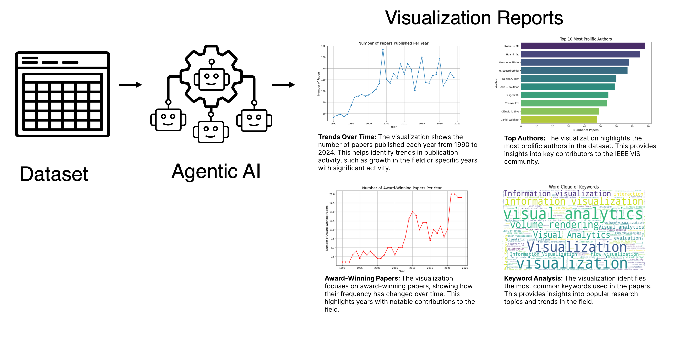
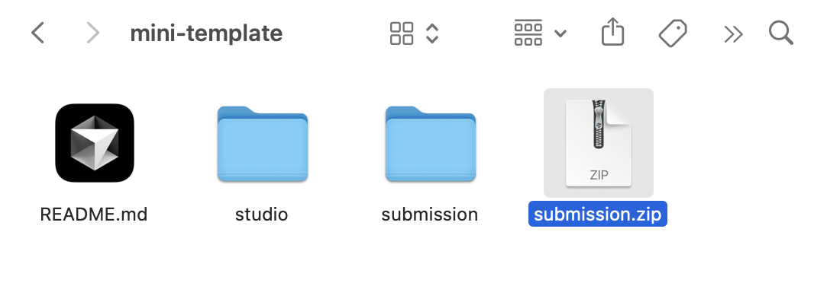
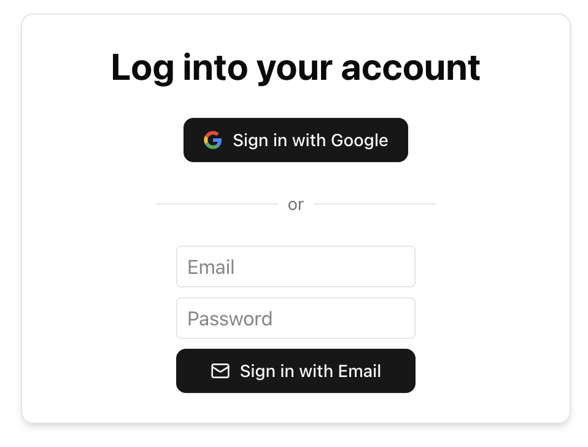
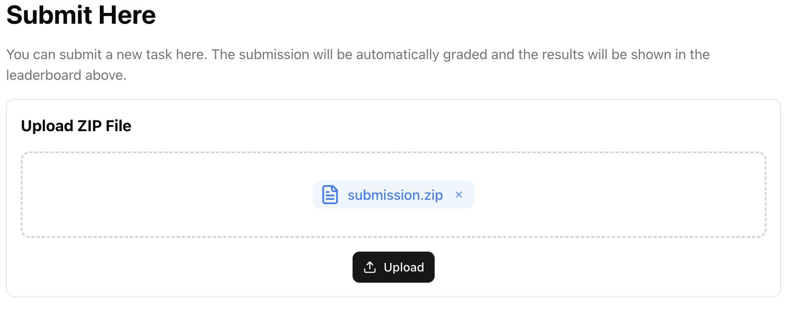
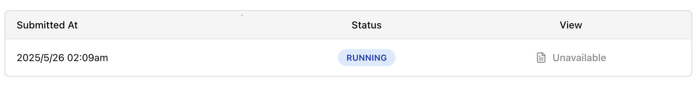
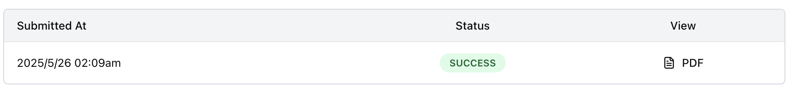
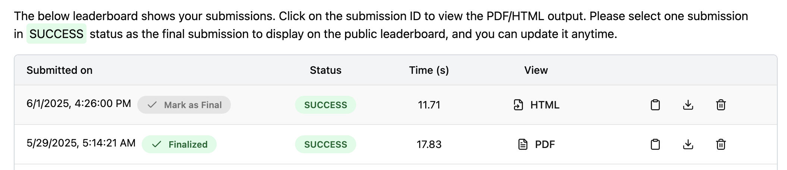
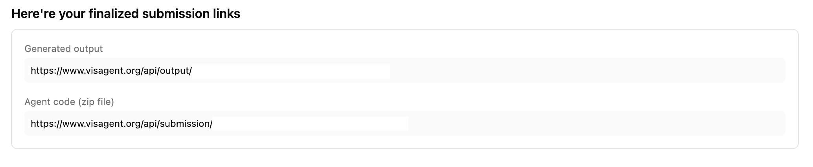

# Mini Challenge Template

Welcome! This repo provides: 

* `studio/`: **A complete development playground** for building and testing agent with LangGraph Studio UI. Please run the template locally in this folder. 
    * `agent.py`: Core agent configuration. 
    * `dataset.csv`: Dataset for visualization.
    * `run.py`: Test `agent.py` locally.
    * `report_html.py`, `report_pdf.py`, `helpers.py`: Supplimentary files. 
    * `langgraph.json`: Configuration file for LangGraph Studio.
* `submission/`: **The minimal submission structure** you’ll package, compress in ZIP file, and submit via challenge website(only what’s required to submit to evaluation server). 
    * `agent.py` - your Agent implementation (Required)
    * `requirements.txt` - all dependencies needed  (Required)
    * All supplimentary files if any, e.g., `helpers.py`, `report_html.py`, `report_pdf.py`, etc.

The template generates visualization reports with both charts and narrative (right part of the image).


Please follow the instructions below to get started.
- [0 - Prerequisites](#0-prerequisites)
- [1 - Configure local API](#1-configure-api)
- [2 - Begin the Template and Studio](#2-begin-the-template-and-studio)
- [3 - Submission](#3-Submission)

## 0 Prerequisites

- Python 3.11+

This version is required for optimal compatibility with LangGraph. If you're on an older version, upgrading will ensure everything runs smoothly.
```
python --version
```

Either download the Mini Challenge Template or clone it to local machine. 

```
git clone https://github.com/ppphhhleo/mini-template.git
$ cd mini-template
```

Create an environment and install dependencies.
<!-- #### Mac/Linux/WSL -->
```
$ python -m venv mini-template-env
$ source mini-template-env/bin/activate
$ cd mini-template/studio
$ pip install -r requirements.txt
```
<!-- #### Windows Powershell
```
PS> python -m venv mini-template-env
PS> Set-ExecutionPolicy -ExecutionPolicy RemoteSigned -Scope Process
PS> mini-template-env\scripts\activate
PS> cd mini-template/studio
PS> pip install -r requirements.txt -->
<!-- ``` -->

## 1 Configure API 
* OpenAI. Origianlly, the template uses OpenAI API to run **locally**. You can sign up [here](https://openai.com/index/openai-api/). 
    * Set `OPENAI_API_KEY` in `.studio/.env` file,
    * Set `OPENAI_MODEL = "gpt-4o"` in `.studio/.env` file,
    * Set `LLM_PROVIDER = "openai"` in `.studio/.env` file
    The evaluation server uses Azure OpenAI to run your submission once you upload your submission, and you do *not* need to fill in the Azure OpenAI endpoint, API key, and deployment name.
<!-- 
* [Optional]: If you want to use LangSmith. Sign up for LangSmith [here](https://smith.langchain.com/). Use it within your workflow [here](https://www.langchain.com/langsmith), and relevant library [docs](https://docs.smith.langchain.com/).
    *    Set `LANGCHAIN_API_KEY`, `LANGCHAIN_TRACING_V2=true` in `.studio/.env` file  -->

<!-- * [Optional]: If web search is  Tavily. Tavily Search API is a web search engine optimized for LLMs and RAG, aimed at efficient, 
quick, and persistent search results. You can sign up for free for an API key [here](https://tavily.com/). 
    *   Set `TAVILY_API_KEY` in `.studio/.env` file.  -->

<!-- * Azure OpenAI. We provide a remote Azure LLM provider for free testing, and you can reach out to Pan Hao to get the AZURE_OPENAI_API_KEY and set the following environment variables:
```
export LLM_PROVIDER=azure
export AZURE_OPENAI_ENDPOINT=https://eval-models.openai.azure.com/
export AZURE_OPENAI_API_KEY=api_key
export AZURE_OPENAI_DEPLOYMENT=gpt-4o
``` -->


## 2 Begin the Template and Studio

### 2.1 Run the template 

```
cd studio
python run.py
python -m http.server 8001
```

If the template is running successfully the first time, the output can be viewed via `http://localhost:8001/output.html`. 

If you want the template to generate Python charts, please adjust the ``sys_prompt``, ``file_name``, and ``decode_output`` function in the `agent.py` file accordingly (see the comments in the `agent.py` file), then run the following command, and the output will be saved in ``studio/output.pdf``
```
python run.py
```


### 2.2 Optionally, Run LangGraph Studio to Visualize the Agentic Configuration
LangGraph Studio is a custom IDE for viewing and testing agents, and it can be run locally and opened in your browser on Mac, Windows, and Linux.
See documentation about LangGraph CLI [here](https://langchain-ai.github.io/langgraph/cloud/reference/cli/) for both Python and JS configurations.

```
npx @langchain/langgraph-cli dev
```
* Open your browser and navigate to the Studio UI: `https://smith.langchain.com/studio/?baseUrl=http://localhost:2024`.
* Configuration file is the `/studio/langgraph.json` file.

### 2.3 Update your agentic configuration

Feel free to customize the `agent.py` and its companion files to craft your own agentic configuration, and try to make your designs and results outperform the template baseline, by demonstrating your solution's **generalizability to other datasets**, **efficiency in running**, and **effectiveness in generating effective and engaging narrative-driven visualization reports**.

Please ensure you **refer the dataset** as `dataset.csv` or `https://raw.githubusercontent.com/demoPlz/mini-template/main/studio/dataset.csv` as the file path to access the data, e.g., specifying in the prompt; and refer to `output.html` or `output.pdf` as the output file, and include every dependency needed in `requirements.txt`


## 3 Submission 

### 3.1 Preparing Your Submission

1. **Verify the codes.** Please make sure the codes execute without errors before packing your submission.

```
python run.py
```


2. **Package the files.** Please copy all related files from `studio/` into the `submission/` folder (replace any files if needed).
* `agent.py` - your Agent implementation (Required)
* `requirements.txt` - all dependencies needed  (Required)
* All supplimentary files if any, e.g., `helpers.py`, `report_html.py`, `report_pdf.py`, etc.

3. **Compress in ZIP file.** ZIP the `submission/` folder (do not include any extra files or foler) as `submission.zip`



### 3.2 Submit for the Challenge

#### 1. Go to https://www.visagent.org/, sign in or register:


#### 2. Navigate to your submission page and upload your submission.zip file:



#### 3. View all your submissions with their status and results, then select one entry as your finalized submission for the public leaderboard:


 



#### 4. Reference the links for your finalized output with the same submission ID in your technical paper to be submitted to PCS:



## References
- [Langchain Academy](https://github.com/langchain-ai/langchain-academy)